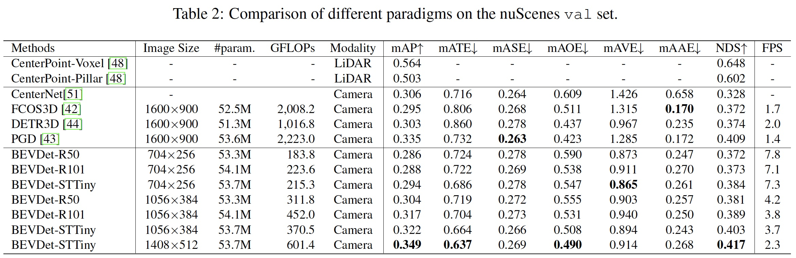
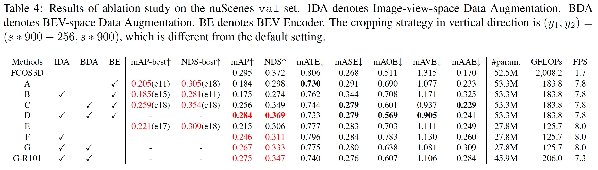

# [BEVDet: High-Performance Multi-Camera 3D Object Detection in Bird-Eye-View](https://arxiv.org/pdf/2112.11790.pdf) 

December 2021

### Overall Impression

This paper adopts the estiablished BEV object detection framework (i.e., image encoder, view transformer, BEV encoder and head) and analyzes a few difference choices of these modules. It emphasizes that since the view transformer isolates the two view spaces (image and BEV), augmentations in the image space do not affect the BEV space. Hence augmentations in both the image space and the BEV space can be applied. The takeways of this study are: 1) SwinTransformer performs better than ResNet, 2) larger image size can improve mAP, 3) Employing both Image-view-space Data Augmentation (IDA) and BEV-space Data Augmentation (BDA) help to imporve performance.

### Key Ideas

- Network architecture:
  - Image-view encoder: ResNet and SwinTransfomer
  - View transformer: Voxel Pooling. Other subsitutions are mentioned but not evaluated: PON, VPN, PYVA.
  - BEV encoder: ResNet + FPN-LSS.
  - Heads: 3D object detection head
- Augmentation: 
  - IDA: random flipping, random rotating with a range of [−5.4, 5.4], and random scaling with a range of [0.386, 0.55].
  - BDA:  random flipping, random rotating with a range of [−22.5, 22.5], and random scaling with a range of [0.95, 1.05].

### Notes

- SwinTransformer in general performs stronger than ResNet.
- The input size has a large impact on the performance. BEVDet with 1408x512 input size has a 5% mAP superiority on that with 704x256 input size.
- The increase of input size, the scale of the BEVDet computing budget is not a quadratic of the input size variance, as the computing budget of the BEV encoder and heads is consistent.
- Data augmentation:
  - By applying IDA without BDA, the mAP is even worse than the baseline.
  - By applying BDA without IDA, the mAP is significantly better than the baseline.
  - Employing both IDA and BDA achives the best mAP. Therefore, IDA has a negative impact on the mAP when BDA is absent but has a positive impact when BDA is present.
- Employing the BEV encoder improves the performance (but the authors do not describe the subsitution when the BEV encoder is NOT employed).
- The augmentations have mixed effects on pose, velocity and attribute prediction results. 

  

  

