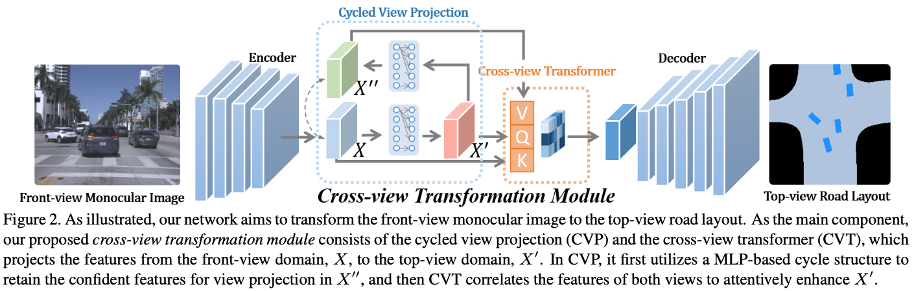
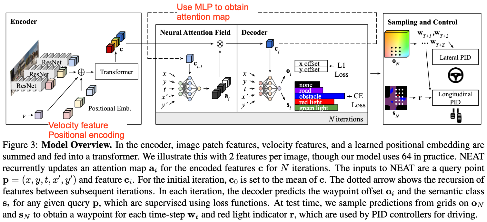
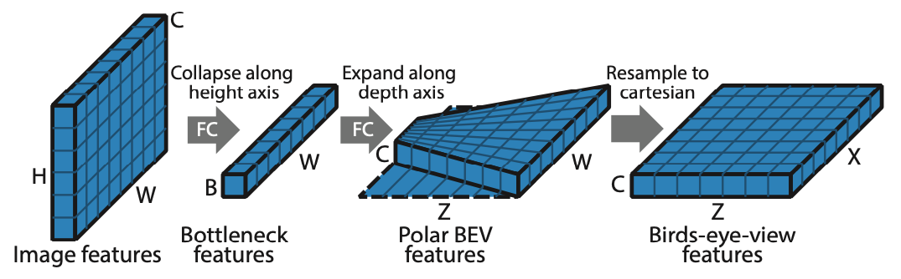
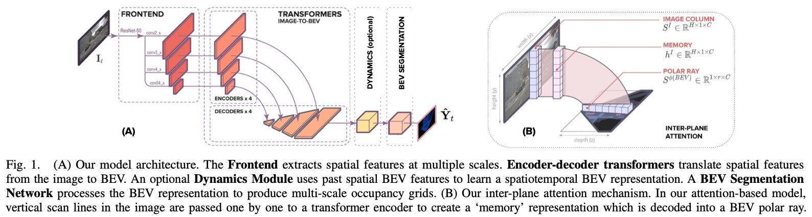
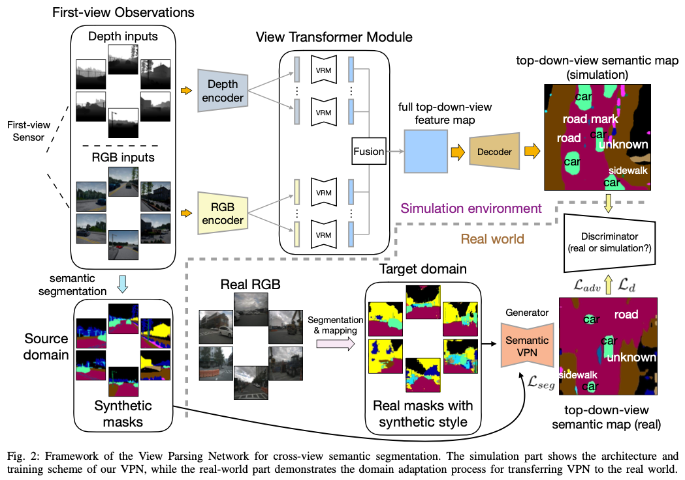
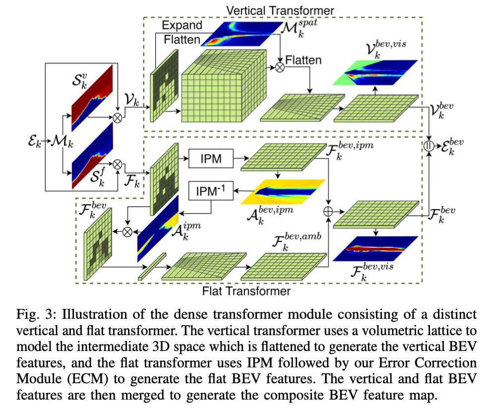

# Papers on Camera-to-BEV Transformation

### [Projecting Your View Attentively: Monocular Road Scene Layout Estimation via Cross-view Transformation](https://openaccess.thecvf.com/content/CVPR2021/papers/Yang_Projecting_Your_View_Attentively_Monocular_Road_Scene_Layout_Estimation_via_CVPR_2021_paper.pdf) \[PYVA\]\[CVPR 2021\] 

*TL;DR* — A cross-attention approach

The core of PYVA is an MLP to lift image features in the perspective space to the BEV space. A cross-attention module is then applied using keys and values from the perspective space features and queries from the BEV space features to enhance the BEV space feature.

  

### [NEAT: Neural Attention Fields for End-to-End Autonomous Driving](https://arxiv.org/pdf/2109.04456.pdf) \[ICCV 2021\]

*TL;DR* — An iterative local linear projection approach

The most interesting part of NEAT is feature lifting from the perspective space to the BEV space. It employs an iterative process: the BEV coordinate $(x,y)$ and the lifted feature $c_{i-1}$ are combined and processed by an FC layer to produce an attention map $a$ of the same shape as the perspective feature. The attention map is then used to pool the perspective feature to produce lifted BEV feature $c_i$.

  

### [Predicting Semantic Map Representations from Images using Pyramid Occupancy Networks](https://arxiv.org/pdf/2003.13402.pdf) \[PryOccNet\]\[CVPR 2020\]

*TL;DR* — A simplified IPM projection approach

In PryOccNet, the perspective features are lifted to the BEV space a three steps: 1) the image features are condensed along the vertical direction to produce a 1xW bottleneck feature, 2) the bottleneck feature is broadcasted in the polar coordinates in the BEV space, 3) the polar BEV features are resampled to the Cartesian coordinates.

pryoccnet_transform

  

> *This is a coarse and simplified version of IPM. It ignores the perspective-to-BEV relation in the vertical direction. The ablation study shows that PryOccNet outperforms IPM feature lifting, but the comparison seems not to be apple-to-apple as the PryOccNet also features other improvements such as the feature pyramid.*

### [Translating Images into Maps](https://arxiv.org/pdf/2110.00966.pdf)

*TL;DR* — A physically grounded transformer

While PryOccNet oversimplifies the perspective-to-BEV mapping by ignoring the vertical direction of the perspective space, TIIM exploits the perspective geometry property that pixels in a column of the camera image can only be mapped to pixels along a polar ray in the BEV space. Therefore, it employs a cross-attention transformer to convert each column of the camera image to a polar ray in the BEV space. The cross-attention transformer treats the features of the column as keys and values, and learns a positional query that encodes the relative position along the polar ray.

  

### [Cross-view Semantic Segmentation for Sensing Surroundings](https://arxiv.org/pdf/1906.03560.pdf) \[VPN\]

*TL;DR* — Use MLP-based view transformer

This work employs two MLP layers to project each camera image feature separately to the BEV space. The projected BEV features are then summed up to obtain the final BEV feature.

  

### [Bird’s-Eye-View Panoptic Segmentation Using Monocular Frontal View Images](https://arxiv.org/pdf/2108.03227.pdf)

This paper divides the camera image into flat and vertical regions, and conduct view transformation differently for these two regions. For flat region, the view transformation can be modeled by IPM. For vertical region, a spatial occupational distribution is estimated and used to lift image features to the BEV space (which is similar to Lift-Splat-Shoot).

panopticbev_system

  
