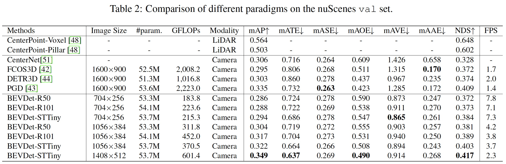
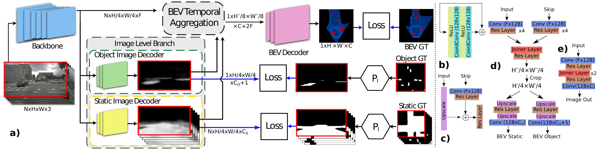

# Papers on Camera-to-BEV Transformation

### [BEVDet: High-Performance Multi-Camera 3D Object Detection in Bird-Eye-View](https://arxiv.org/pdf/2112.11790.pdf) 

#### Overall Impression

This paper adopts the estiablished BEV object detection framework (i.e., image encoder, view transformer, BEV encoder and head) and analyzes a few difference choices of these modules. It emphasizes that since the view transformer isolates the two view spaces (image and BEV), augmentations in the image space do not affect the BEV space. Hence augmentations in both the image space and the BEV space can be applied. The takeways of this study are: 1) SwinTransformer performs better than ResNet, 2) larger image size can improve mAP, 3) Employing both Image-view-space Data Augmentation (IDA) and BEV-space Data Augmentation (BDA) help to imporve performance.

#### Key Ideas

- Network architecture:
  - Image-view encoder: ResNet and SwinTransfomer
  - View transformer: Voxel Pooling. Other subsitutions are mentioned but not evaluated: PON, VPN, PYVA.
  - BEV encoder: ResNet + FPN-LSS.
  - Heads: 3D object detection head
- Augmentation: 
  - IDA: random flipping, random rotating with a range of [−5.4, 5.4], and random scaling with a range of [0.386, 0.55].
  - BDA:  random flipping, random rotating with a range of [−22.5, 22.5], and random scaling with a range of [0.95, 1.05].

#### Notes

- SwinTransformer in general performs stronger than ResNet.
- The input size has a large impact on the performance. BEVDet with 1408x512 input size has a 5% mAP superiority on that with 704x256 input size.
- The increase of input size, the scale of the BEVDet computing budget is not a quadratic of the input size variance, as the computing budget of the BEV encoder and heads is consistent.
- Data augmentation:
  - By applying IDA without BDA, the mAP is even worse than the baseline.
  - By applying BDA without IDA, the mAP is significantly better than the baseline.
  - Employing both IDA and BDA achives the best mAP. Therefore, IDA has a negative impact on the mAP when BDA is absent but has a positive impact when BDA is present.
- Employing the BEV encoder improves the performance (but the authors do not describe the subsitution when the BEV encoder is NOT employed).
- The augmentations have mixed effects on pose, velocity and attribute prediction results. 

  

  

### [Understanding Bird’s-Eye View of Road Semantics using an Onboard Camera](https://arxiv.org/pdf/2012.03040.pdf)

*TL;DR* — Instance segmentation using polygon with a self-attended transformer network to fine-tune the polygon 

#### Summary:

1. The model has a image level branch, which encodes and decodes the camera image to static and dynamic object predictions. This branch is trained using supervision in the camera image space.
2. The core of this paper is the BEV temoral aggregration, which consists of temporal warping and aggregation.
   1. Temporal warping: the image plane features and image level branch output heatmaps are warped using IPM 
   2. Temporal aggregation: the warped image plane features are aligned in the extended BEV space based on odometry. A max pooling over time is performed to obtain a combined feature map. The same operation is applied on the warped static image branch heatmap. In the end, four parts are aggregated: 1) the combined feature map, 2) the feature map of the current frame, 3) the dynamic image branch heatmap, 4) the combined static image branch heatmap.
3. Training loss: pixel-wise segmentation focal loss of these predictions:
   1. Image-level prediction.
   2. BEV space space prediction of semanic HD map and dynamic objects.

  

### [Projecting Your View Attentively: Monocular Road Scene Layout Estimation via Cross-view Transformation](https://openaccess.thecvf.com/content/CVPR2021/papers/Yang_Projecting_Your_View_Attentively_Monocular_Road_Scene_Layout_Estimation_via_CVPR_2021_paper.pdf) \[PYVA\]\[CVPR 2021\] 

*TL;DR* — A cross-attention approach for camera-to-BEV view transform

The core of PYVA is an MLP to lift image features in the perspective space to the BEV space. A cross-attention module is then applied using keys and values from the perspective space features and queries from the BEV space features to enhance the BEV space feature.

  

### [NEAT: Neural Attention Fields for End-to-End Autonomous Driving](https://arxiv.org/pdf/2109.04456.pdf) \[ICCV 2021\]

*TL;DR* — An iterative local linear projection approach for camera-to-BEV view transform

The most interesting part of NEAT is feature lifting from the perspective space to the BEV space. It employs an iterative process: the BEV coordinate $(x,y)$ and the lifted feature $c_{i-1}$ are combined and processed by an FC layer to produce an attention map $a$ of the same shape as the perspective feature. The attention map is then used to pool the perspective feature to produce lifted BEV feature $c_i$.

  

### [Predicting Semantic Map Representations from Images using Pyramid Occupancy Networks](https://arxiv.org/pdf/2003.13402.pdf) \[PryOccNet\]\[CVPR 2020\]

*TL;DR* — A simplified IPM projection method for camera-to-BEV view transform

In PryOccNet, the perspective features are lifted to the BEV space a three steps: 1) the image features are condensed along the vertical direction to produce a 1xW bottleneck feature, 2) the bottleneck feature is broadcasted in the polar coordinates in the BEV space, 3) the polar BEV features are resampled to the Cartesian coordinates.

pryoccnet_transform

  

> *This is a coarse and simplified version of IPM. It ignores the perspective-to-BEV relation in the vertical direction. The ablation study shows that PryOccNet outperforms IPM feature lifting, but the comparison seems not to be apple-to-apple as the PryOccNet also features other improvements such as the feature pyramid.*

### [Translating Images into Maps](https://arxiv.org/pdf/2110.00966.pdf)

*TL;DR* — A physically grounded camera-to-BEV view transform

While PryOccNet oversimplifies the perspective-to-BEV mapping by ignoring the vertical direction of the perspective space, TIIM exploits the perspective geometry property that pixels in a column of the camera image can only be mapped to pixels along a polar ray in the BEV space. Therefore, it employs a cross-attention transformer to convert each column of the camera image to a polar ray in the BEV space. The cross-attention transformer treats the features of the column as keys and values, and learns a positional query that encodes the relative position along the polar ray.

  

### [Cross-view Semantic Segmentation for Sensing Surroundings](https://arxiv.org/pdf/1906.03560.pdf) \[VPN\]

*TL;DR* — Use MLP-based camera-to-BEV view transform

This work employs two MLP layers to project each camera image feature separately to the BEV space. The projected BEV features are then summed up to obtain the final BEV feature.

  

### [Bird’s-Eye-View Panoptic Segmentation Using Monocular Frontal View Images](https://arxiv.org/pdf/2108.03227.pdf)

This paper divides the camera image into flat and vertical regions, and conduct view transformation differently for these two regions. For flat region, the view transformation can be modeled by IPM. For vertical region, a spatial occupational distribution is estimated and used to lift image features to the BEV space (which is similar to Lift-Splat-Shoot).

  
