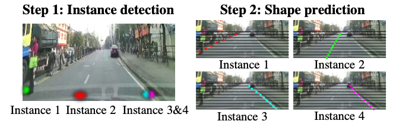
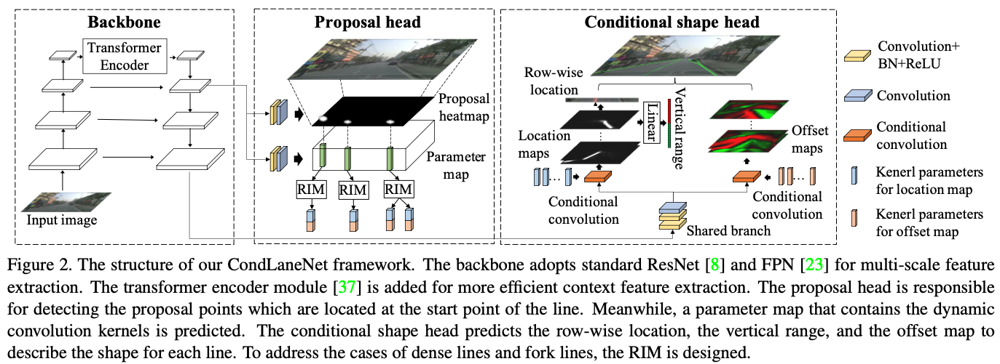
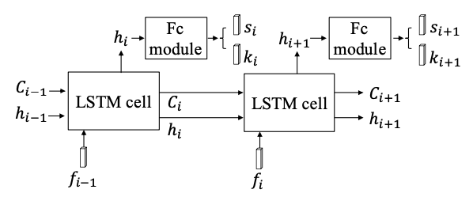

# [CondLaneNet: a Top-to-down Lane Detection Framework Based on Conditional Convolution](https://openaccess.thecvf.com/content/ICCV2021/papers/Liu_CondLaneNet_A_Top-To-Down_Lane_Detection_Framework_Based_on_Conditional_Convolution_ICCV_2021_paper.pdf) 
December 2021

### Key Ideas
- From the highest level, it has a two-step process: 
    1. **Instance detection step**: predict the object instance and regresses a set of dynamic kernel parameters for each instance. 
    2. **Shape prediction step**: apply conditional convolutions to specify the instance shape.
- The instance detection step detects the lane instance at the start point of the line (i.e., the bottom of the image). Conditional convolution kernal are predicted dynamically for each instance, and used for the downstream segmentaiton task. Reference \[[ConInst](https://arxiv.org/pdf/2003.05664.pdf)\]\[[SOLOv2](https://arxiv.org/pdf/2003.10152.pdf)\]
- The segmentation module (a.k.a. shape prediction step) comprises three components:
    1. Row-wise location to detect the lane's location in each row of the image
    2. Vertical range to detemine which rows have lanes passing through
    3. Offset map to estimate the offset from each pixel to the corresponding lane's center
  - It also features a recurrent instance module to handle lane fork and lane merge. Rows are processed sequentially by an LSTM module, which produces a 2-d logits `s_i`indicating "continue" and "stop". It also produces a vector `k_i`, which is used by the subsequent shape prediction step. The input `f_i` is a feature map produced by the backbone network. 

### Implementation Details
- Since lanes can go between two pixels, instead of using the pixel with the highest response as the row-wise location results, the final location is produced by taking the expected coordinate (using probablity produced by softmax). L1-loss of the localiztion is applied during training.

###  Discussion
- Forked lanes are treated as different instances at the begining, which can be far from the fork point. If instance detection fails, the fork cannot be detected.
- The core underlying assumption is that the lane lines are continuous. It cannot handle more topological complex road structures (e.g. roundabout, intertection, etc.)

