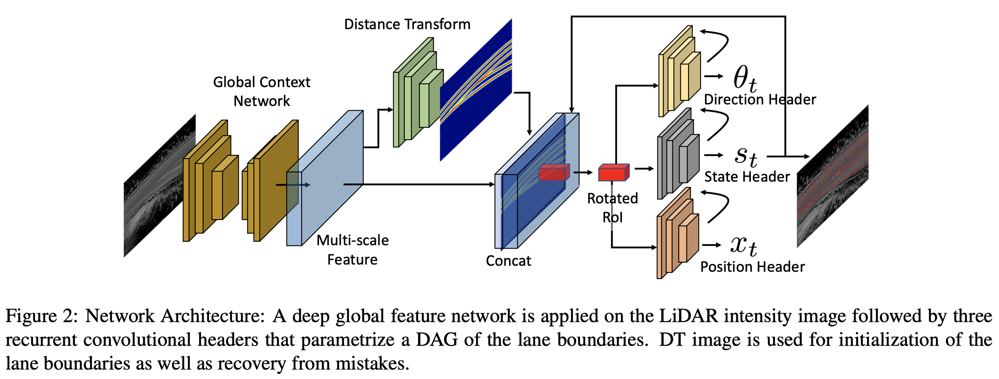
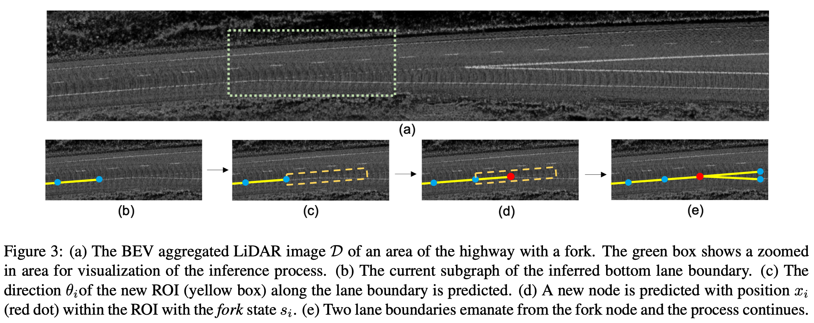

# [DAGMapper: Learning to Map by Discovering Lane Topology](https://arxiv.org/pdf/2012.12377.pdf)
December 2021

## Overview
This paper aims to address the HD mapping problem, i.e., reconstructing the lane line structures in the BEV. It focuses on the ablity to map from a **single** pass of the viechle (previous methods requires multiple passes).

## Key Ideas
- Describe the lane lines by a directional acyclic graph (DAG), denoted as $G=(V, E)$. Each node $v_i=(x_i, \theta_i, s_i)$ encodes geometric and topological properties of the local lane boundary, including the position of the vertex $x_i$, the turning angle $\theta_i$ and the continue/terminate/diverge state $s_i$. The problem is formulated as finding the MAP over the space of all possible graphs, given the observation data $D$.
- Key assumption of the probability calculation:
    - The vertices are independent: the probabiliy of the graph equals to the product of the probabilities of the vertices.
    - The properties of each vertex are independent: the probability of the vertex equals to the product of the probabilities of the properties.
- The graph is predicted vertex-by-vertex starting from the initial vertices. The every iteration, the parent vertex will spit out its child vertex/vertices. 
- Network structure:
    - Global feature network with an encoder-decoder architecture
    - Distance transform network to predict the distance to the closest lane boundary
    - Direction head to predict the direction variable $\theta_i$. The input is a rotated ROI.
    - Position head to predict the location variable $x_i$.
    - State head to predict the state variable $s_i$.
- Loss: Chamfer distance to measure the distance between two densely sampled curves without correspndence. 

## Notes
- The state variable $s_i$ is used to spawn new vertices at the forks. How does the know not to predict the same lane from the two very close vertices at the fork?

