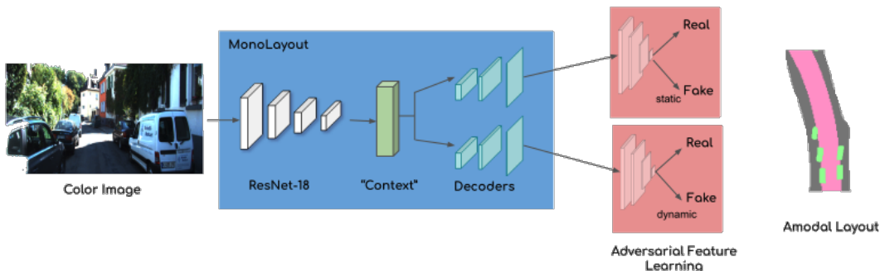

# Papers on Adversarial Learning

### [MonoLayout: Amodal scene layout from a single image](https://arxiv.org/pdf/2002.08394.pdf)

*TL;DR* - Camera-to-BEV segmentation model with adversarial learning 

  
