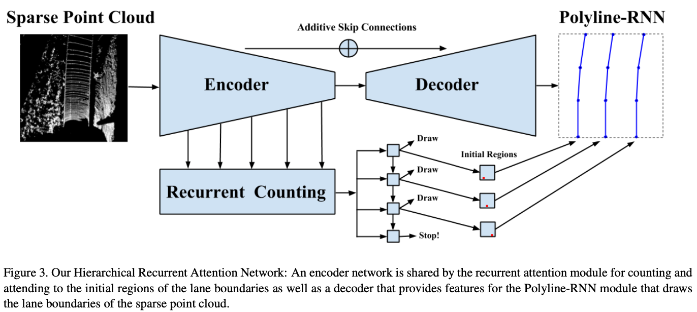

# [Hierarchical recurrent attention networks for structured online maps](https://arxiv.org/abs/2012.12314) 

Jan 2022

*TL;DR* - Use polyline-RNN (conv-LSTM) to produce road boundary from LIDAR sweep.

### Key Ideas

- Input: LIDAR sweep is projecte to the BEV space to produce a LIDAR intensity map $x \in \mathbb{R}^{H \times W \times 1}$.
- Backbone: ResNet with FPN.
- Reccurent lane counting module: a conv-LSTM model is employed to iteratively produce the starting position of each lane in a $K \times K$ grid. 
- Lane boundary prediction module: given the starting position, a Conv-LSTM is employed to iteratively produce the lane boundary vertices. The input of the conv-LSTM is an ROI in the feature map centered on the previous (or starting) vertex.
- Training loss:
  - Attention loss: cross entropy.
  - Polyline loss: the point-to-curve distance between the predicted polyline and the ground truth polyline. 

  
