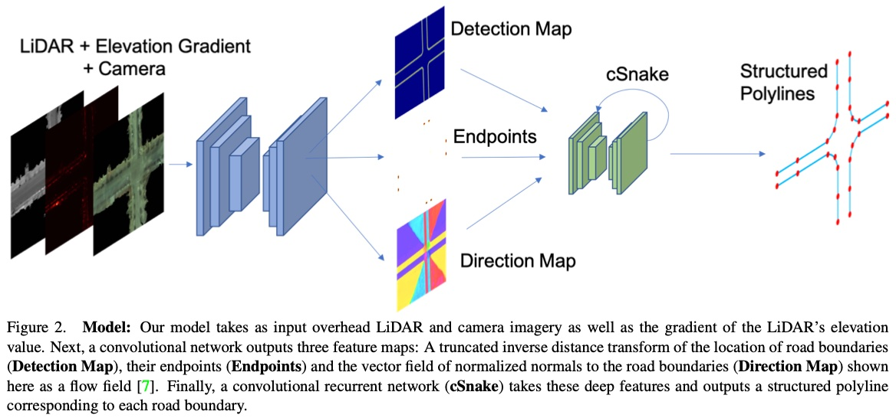
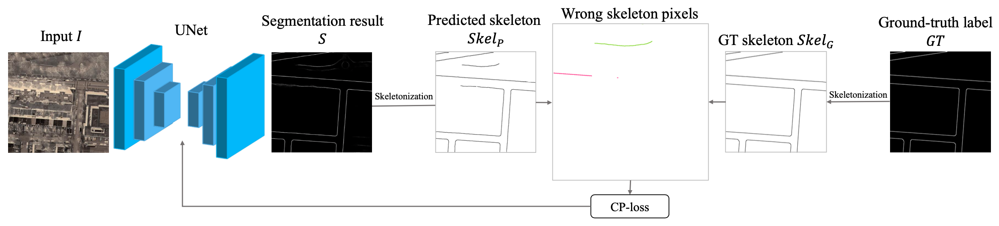

# Papers on Lane Line Detection and Map Reconstruction

### [Hierarchical recurrent attention networks for structured online maps](https://arxiv.org/abs/2012.12314) 

*TL;DR* - Use polyline-RNN (conv-LSTM) to produce road boundary from LIDAR sweep.

#### Key Ideas

- Input: LIDAR sweep is projecte to the BEV space to produce a LIDAR intensity map $x \in \mathbb{R}^{H \times W \times 1}$.
- Backbone: ResNet with FPN.
- Reccurent lane counting module: a conv-LSTM model is employed to iteratively produce the starting position of each lane in a $K \times K$ grid. In every step, it outputs a probablity map of the next lane starting point, and a probablity of halting (all lanes are counted).
  - Lane boundary prediction module: given the starting position, a Conv-LSTM is employed to iteratively produce the lane boundary vertices. The input of the conv-LSTM is an ROI in the feature map centered on the previous (or starting) vertex.

- Training loss:
  - Attention loss (lane counting): cross entropy.
  - Polyline loss (lane tracing): the point-to-curve distance between the predicted polyline and the ground truth polyline. 

  

### [Convolutional Recurrent Network for Road Boundary Extraction](https://arxiv.org/pdf/2012.12160.pdf) \[CVPR 2019\]

*TL;DR* - Use CNN on local patches of BEV features to iteratively produce road boundary vertices

#### Overall Impression

This is an extension of the same authors’ prior work, HRANet. The main differences are: 1) Starting points are predicted using landmark detection setting, 2) polylines are predicted using CNN instead of LSTM, 3) the input to the polyline detection phase has physical meaning.

#### Key Ideas

- Input data: LIDAR/camera data projected to the BEV space image with 5 channels: RGB and gradients of height.
- Backbone: encoder-decode network with three output heads:
  - Detection map: distance transform to road boundaries
  - End points: probability map of the location of the end points
  - Direction map: normal direction of the road boundaries
- Convolutional snake (cSnake)
  - Input: detection map and direction map.
  - Starting from each end point, iteratively apply CNN on local patch around the previous detected vertex to produce a polyline.
  - The iteration stops when the produce vertex is outside of the image.
  - The average detection score of polyline vertices is calculated for each predicted polyline. The score is used to: 1) filter false positives, 2) merge duplicated polylines (the one with the higher score is kept).
- Loss: 
  - Visual features (three heads): regression loss
  - Convolutional snake: Chamfer loss

  

### [Structured Bird’s-Eye-View Traffic Scene Understanding from Onboard Images](https://arxiv.org/abs/2110.01997) 

#### Overall Impression

The core idea of STSU is similar to DETR3 D, i.e., using trainable queries to retrieve object detection results. The main novelty lies in the formulation of road network as centerline objects. The definition of centerline is critical (i.e., if and how are the starting/ending points uniquely defined) because it can cause ambiguity in the model's prediction (e.g., should it produce one long centerline? or multiple shorter centerlines?). Unfortunately, I don't see clear definition of centerlines in this paper.

#### Key Ideas

- Formulation:
  - *Centerlines*: The road netowrk is conceptually described by a directed graph $G=(V,E)$. In the implementation, the graph consists of a number of "centerlines" described by Bézier curve control points. The connectivity is described by an incidence matrix $I$. 
  - *objects*: Objects like viechels are described by BEV bounding boxes with 5 DoF. The formulation is the same as DETR3D.
  - A transformer-based neural network takes the camera image as input ans outputs the detection results of both centerlines and objects.
- Architecture:
  - A transformer-based architecture is employed. Two sets of queries for centerlines and objects are used to produce detection resutls, similar to DETR. 
  - Positional encoding are added to the input feature map, including: 1) image domain positional encoding, and 2) BEV location positional encoding (convert image pixels to BEV location with a flat suface assumption. Logarithm is applied to make the encoding more evenly distributed).
  - Lane branch:
    - **Detection head**: tells if the centerline corresponding to the query exists.
    - **Control head**: outputs the Beizer curve control points.
    - **Association head**: produces *association feature vectors*, which are used in association classification.
    - **Association classifier**: takes two *association feature vectors* as input and outputs the probability of the input centerlines are connected. 
  - Object branch:
    - **Detection head**: tells if the object corresponding to the query exists.
    - **5-params head**: outputs the 5 DoF parameters of the object bounding box.
    - **Refinement net **: outputs segmentation of the object bounding box in the RoI
- Loss: Detection results (both centerlines and objects) are matched with the ground truth using Hungarian matching. Training loss is calculated on matched objected as $L_{CE}+\lambda L_1$, where the first term is classification loss and the second term is the loss of the parameters (Bézier control points or bounding boxes). 
- Ground truth: The definition of centerline instances is not clear. Need to look into the [code](https://github.com/ybarancan/STSU) for more details. 

### [Topology Preserving Local Road Network Estimation from Single Onboard Camera Image](https://arxiv.org/pdf/2112.10155v1.pdf)

#### Overall Impression

This paper is a follow up work of STSU (see my previous [notes](STSU.md)). The main expansion is the addition of a topology preserving loss. Another difference from STSU is that in this paper, the authors recognize that Using Hungarian matching is not ideal since it does not consider the fragmentation of the estimated curves.

#### Key Ideas

- Notations:
  - $G(V,E)$ road network graph
  - $T(C, I)$ topological structure, where $C$ is the curves, $I_c \in I$ is the intersections.
  - Minimal cycle: cycles formed by curves where no curve intersects the enclosed area.
  - Minimal cover: set union of the curves that form the minimal cycle.
- Lemma:
  1. A minimal closed polycurve (minimal cycle) MC is uniquely identified by its minimal cover $B$.
  2. The global intersection order of the two structures are same if and only if the sets of minimal cycles are same.
  3. **The global intersection order can be uniquely described by the set of minimal covers $B$.**
     This is the most important lemma, which translates the topology preserving problem into a minimal cover detection problem, which can be modeled by classifiers. 
- Network Architecture:
  - Outputs: $V_c$ of size $N\times D$ which is a $D$ dimensional embedding for all $N$ curve candidates and $V_m$ of size $M \times E$, which is a $E$ dimensional embedding for all $M$ minimal cover candidates.
  - $V_c$ is processed in a similar way as STSU
  - $V_m$ is processed to produce three parts for every minimal cover candiates
    1. $Z_M^q$ A probablity of belonging to this minical cover is predicted for each curve.
    2. $Z_M^p$ A probability that this minical cover exists.
    3. $Z_M^r$ The center of this minical cover.
  - Network options: 1) transformer, 2) polygon-RNN.
- Training:
  - Min Matching:
    - Each candidate curve is matched to its closest GT curve.
    - For all the matched estimated curves whose corresponding GT curve is present in a minimal cover, set the membership target of $Z_M^q$ to 1.
    - Run Hungarian matching to find the pairs used for loss calculations.
  - Loss
    - $L_1$ loss for spline control points and minimal cycle centers.
    - BCE lsos for centerline and minimal cycle probabilities.
    - BCE loss for membership of minimal covers.

### [CondLaneNet: a Top-to-down Lane Detection Framework Based on Conditional Convolution](https://openaccess.thecvf.com/content/ICCV2021/papers/Liu_CondLaneNet_A_Top-To-Down_Lane_Detection_Framework_Based_on_Conditional_Convolution_ICCV_2021_paper.pdf) 

  

#### Key Ideas

- From the highest level, it has a two-step process: 

  1. **Instance detection step**: predict the object instance and regresses a set of dynamic kernel parameters for each instance. 
  2. **Shape prediction step**: apply conditional convolutions to specify the instance shape.

- The instance detection step detects the lane instance at the start point of the line (i.e., the bottom of the image). Conditional convolution kernal are predicted dynamically for each instance, and used for the downstream segmentaiton task. Reference \[[ConInst](https://arxiv.org/pdf/2003.05664.pdf)\]\[[SOLOv2](https://arxiv.org/pdf/2003.10152.pdf)\]

- The segmentation module (a.k.a. shape prediction step) comprises three components:

  1. Row-wise location to detect the lane's location in each row of the image
  2. Vertical range to detemine which rows have lanes passing through
  3. Offset map to estimate the offset from each pixel to the corresponding lane's center

  - It also features a recurrent instance module to handle lane fork and lane merge. Rows are processed sequentially by an LSTM module, which produces a 2-d logits `s_i`indicating "continue" and "stop". It also produces a vector `k_i`, which is used by the subsequent shape prediction step. The input `f_i` is a feature map produced by the backbone network. 

#### Implementation Details

- Since lanes can go between two pixels, instead of using the pixel with the highest response as the row-wise location results, the final location is produced by taking the expected coordinate (using probablity produced by softmax). L1-loss of the localiztion is applied during training.

####  Discussion

- Forked lanes are treated as different instances at the begining, which can be far from the fork point. If instance detection fails, the fork cannot be detected.
- The core underlying assumption is that the lane lines are continuous. It cannot handle more topological complex road structures (e.g. roundabout, intertection, etc.)

  

  

### [DAGMapper: Learning to Map by Discovering Lane Topology](https://arxiv.org/pdf/2012.12377.pdf)

#### Overview

This paper aims to address the HD mapping problem, i.e., reconstructing the lane line structures in the BEV. It focuses on the ablity to map from a **single** pass of the viechle (previous methods requires multiple passes). 

The most interesting part of this paper is the use of RNN to spit out graph vertices. The idea of using rorated ROIs alone the lane line as the network input is quite smart. By extracted local rorated ROIs, the most important information are preserved while the network input size is significantly reduced.

#### Key Ideas

- Describe the lane lines by a directional acyclic graph (DAG), denoted as $G=(V, E)$. Each node $v_i=(x_i, \theta_i, s_i)$ encodes geometric and topological properties of the local lane boundary, including the position of the vertex $x_i$, the turning angle $\theta_i$ and the continue/terminate/diverge state $s_i$. The problem is formulated as finding the MAP over the space of all possible graphs, given the observation data $D$.
- Key assumption of the probability calculation:
  - The vertices are independent: the probabiliy of the graph equals to the product of the probabilities of the vertices.
  - The properties of each vertex are independent: the probability of the vertex equals to the product of the probabilities of the properties.
- The graph is predicted vertex-by-vertex starting from the initial vertices using a GNN. In every iteration, the parent vertex will spit out its child vertex/vertices.
- Network structure:
  - Global feature network with an encoder-decoder architecture
  - Distance transform network to predict the distance to the closest lane boundary
  - Direction head to predict the direction variable $\theta_i$. The input is a rotated ROI.
  - Position head to predict the location variable $x_i$.
  - State head to predict the state variable $s_i$.
- Loss: Chamfer distance to measure the distance between two densely sampled curves without correspndence. 

#### Notes

- The state variable $s_i$ is used to spawn new vertices at the forks. How does the know not to predict the same lane from the two very close vertices at the fork?

  

  

### [Learning to Predict 3D Lane Shape and Camera Pose from a Single Image via Geometry Constraints](https://arxiv.org/pdf/2112.15351.pdf)

*TL;DR* — One multi-task network that predicts the camera pose and 3D lane line.

#### Summary:

1. 3D lane line detection problem is formulated as a two tasks: 1) estimation of the camera height $h$ and camera pitch $\phi$, 2) estimation of the 3D lane line $[X, Y, Z]$ as a polynomial function. The relation between 3D lane line points and points on flat ground-plane is shown in the figure below.
2. In stage 1, the model estiamtes the camera pose, i.e., height and pitch in one branch and a 3D lane line in another branch. The 3D lane line is mapped to the image plane and the flat ground plane using the estimated extrinsics for loss calculation.
3. In stage 2, the model takes the BEV image projected using the extrinsics estiamted in stage 1 as input, and output the 3D lane lines.
4. Trainin losses: 
   1. Camera pose regression loss
   2. 3D lane fitting loss with Hungarian matching
   3. Flat ground plane lane fitting loss
   4. Image plane lane fitting loss

  

  

### [CP-loss: Connectivity-preserving Loss for Road Curb Detection in Autonomous Driving with Aerial Images](https://arxiv.org/pdf/2107.11920.pdf)

*TL;DR* — A loss designed for line segmentation that imposes skeleton distance-based weighting of Cross Entropy and DICE losses. 

#### Summary:

1. Skeletonization is applied on both the ground truth and predicted masks. For every pixel, the distane to these two skeletons is calculated and used as a weight for loss calculation.
2. For foreground pixels, the minimum distance to the ground truth skeleton is caculated (shouldn't this distance be always zero?). Gaussian of the distance is added o the focal loss weight.
3. On background pixels, the minimum distance to both the ground truth and predicted skeletons is calculated. Gaussian of the distance is added o the focal loss weight.
4. On all pixels, the DICE loss is weighted by a factor negatively correlated with the minimum distance to the ground truth and predicted skeletons.

  

