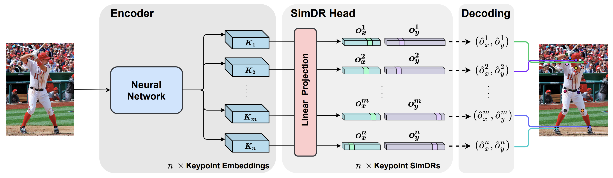

# Papers on Landmark Detection

### [Is 2D Heatmap Even Necessary for Human Pose Estimation?](https://arxiv.org/pdf/2107.03332.pdf)

*TL;DR* - Detect landmark coordinates (x, y) using two separated 1-D heat maps instead of a joint 2-D heatmap

  

