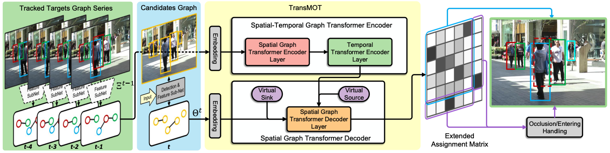
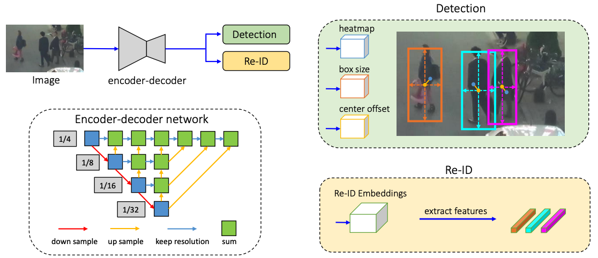

# Papers on Multiple Object Tracking

### [TransMOT: Spatial-Temporal Graph Transformer for Multiple Object Tracking](https://arxiv.org/pdf/2104.00194v2.pdf)

#### Overall impression

Most SOTA MOT methods adopt the tracking-by-detction strategy, where target candidates proposed by the object detector on each frame are associated and tracked. This paper introduces a target association method using graph formulation and spatial/temporal transformer. 

#### Key ideas

##### Architecture

- The model has two inputs: 1) tracklets of the previous frame, 2) candidates from the current frame. The goal is the associate each candidate to a tracklet (existing and entering are modeled as virtual tracklets). The association is solved by optimization on an affinity function, which is modeled by the proposed neural network.
- The tracklets forms a graph, which contains: 1) the status of each tracklet (node), 2) connection edge (connectivity is defined by IoU greater than 0), 3) connection weight set to the IoU.
- Each node contains a feature of size $N\times T \times D$, where $N$ is the number of trackless, $T$ is the length of the history, $D$ is the dimension of the embedding layer.
- **Spatial Graph Transformer Encoder Layer**: A self-attention layer is employed to process the graph features. Difference from the standard self-attention layer:
  - The attention is multiplied by the connection weight matrix, which limits the attention to trackets with spatial interactions.
  - The graph features are processed by graph convolution layers instead of linear layers.
- **Temporal Transformer Encoder Layer**: A standard self-attention transformer layer applied on the temporal domain of the tracklet feature.
- **Spatial Graph Transformer Decoder**: The current frame input is also formulated as a graph, similar to the input tracklet graph.
  - A virtual sink node is added to the candidate graph with 0.5 connection weight to all other nodes. 
  - A virtual soure node is added to the tracklet graph and tracklet embedding.
  - A spatial graph transformer is applied on the candidate graph to produce the candidate embedding
  - Multi-head cross attention is calcuated on the tracklet embedding and candidate embedding to generate unnormalized attention weights. 
  - The cross attention weights are processed by a feed forward layer, a normalization layer, a linear layer and a Softmax layer to generate the affinity matrix that associates candidates with tracklets.

##### Training:

- Each row of the assignment matrix is treated as a probability distribution over the tracklets, and Cross Entropy loss is calculated.

  

### [FairMOT: On the Fairness of Detection and Re-Identification in Multiple Object Tracking](https://arxiv.org/pdf/2004.01888v6.pdf)

*TL;DR* - A combination of CenterNet and re-ID with a bunch of detailed designs which are critical to achieve good tracking results by thorough empirical studies.

#### Key ideas

- DLA-34: A combination of ResNet-34 and DLA with more skip connections between low-level and high-level features similar to FPN.
- Detection branch: built on top of CenterNet.
- Re-ID branch: a convolution layer with 128 kernels on top of backbone features to extract re-ID features for each location.

  

.