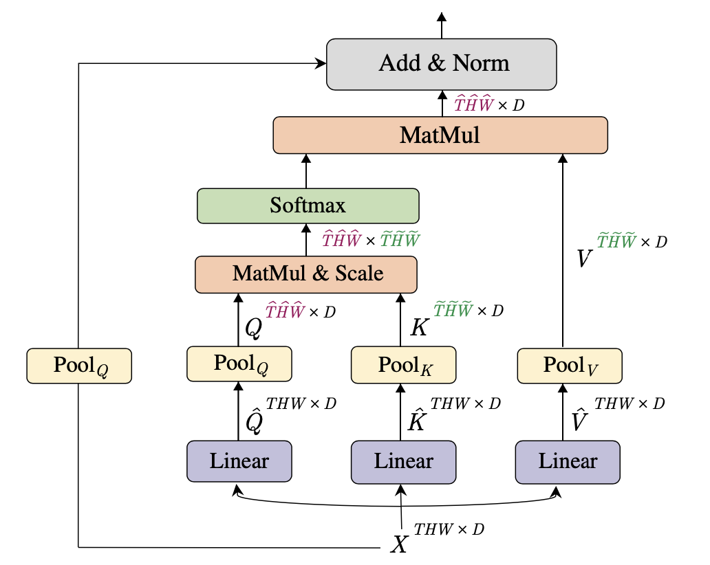
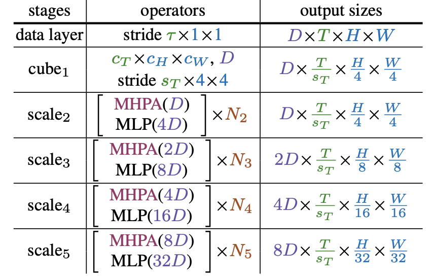

# [Multiscale vision transformers](https://arxiv.org/pdf/2104.11227.pdf) 

December 2021

### Overall Impression

Convolutional Neural Networks typically gradually reduce the spatial resolution (and increase the number of channels) as the layer goes deeper. Vision transformers, however, do not have this "multi-scale" behavior and the number of tokens are usually kept the same throughout the network. To mimick the multi-scale behavior, MViT introduces pooling into the attention module, a.k.a. **Multi Head Pooling Attention (MHPA)**. The keys, values and queries are pooled to reduce the spatial (and temporal for video) resolutions before the attention calculation and application to produce features with a reduced size. In MViT, MHPA is applied to have reduce spatial/temporal resolution (and increase channel) as the layers go deeper. 

One advantage of MViT is the computational efficiency comparing to standard transformers (e.g., ViT and ViViT) due to the reduced resolution and flexibility in choosing the lenght of keys and values. The mult-scale design also seems to have a good intuition behind it, that is, the early layers aggregates information into tokens with coarser spatial/temporal resolution

### Key Ideas

- The core of MViT is the **Multi Head Pooling Attention (MHPA)**, which pools the keys and values to dimension $\tilde{T}\tilde{H}\tilde{W}$ and pools the query to $\hat{T}\hat{H}\hat{W}$ and produces outputs with dimension $\hat{T}\hat{H}\hat{W}$. 
- **Initial scale:** at the input layer, the patches are projected to a smaller channels dimension (8x smallers than the standard ViT) but long sequence (4x4=16x denser than the standard ViT). 
- **Channel expansion**: When the space-time resolution is reduced by 4x, the channel dimension is increased by 2x.
- **Query pooling**: The query pooling controls the space-time resolution. Only the first MHPA in each stage has a query pooling stride >1, while all other operators have query pooling stride=1.
- **Key-value pooling**: While Q pooling is applied in the first layer of each stage, K, V pooling are applied in all other layers. This is mainly due to computation consideration. 

  

  
 