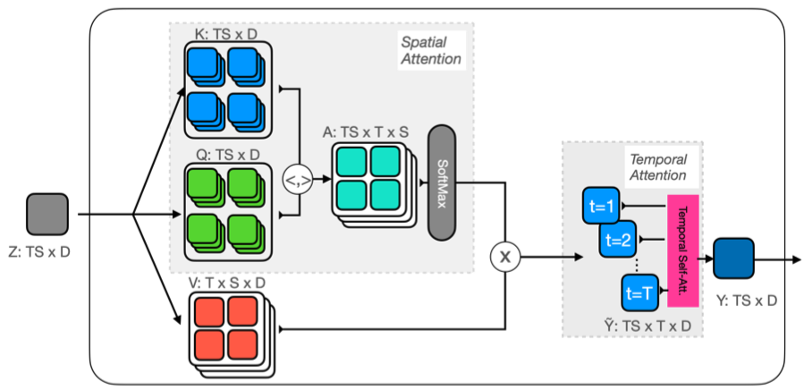

# MotionFormer

### Overall Impression

Transformer modules pool information globally from the entire spatial-temporal domain regardless of the spatial locality (considered as the most important inductive bias). The core idea of this paper is to modify the self-attention mechanism of the standard transformer to lend an inductive bias to the model. Given the theoratically high complexity in both space and time, this paper uses a bottleneck self-attention mechanism. 

### Key Ideas
- Architecture:
    - Use [Cuboid embedding](https://arxiv.org/pdf/2103.15691.pdf) to encode the input video $I \in R^{T' \times 3 \times H \times W}$ into a sequence of $ST$ tokens $\bold{x}_{st} \in R^D$ ($S$ tokens per frame for $T$ key frames).
    - A learnable positional encoding is added for spatial and temporal dimensions separately $\bold{z}_{st} = \bold{x}_{st} + \bold{e}_s^s + \bold{e}_t^t$
    - Video self-attention is applied on $\bold{z}_{st}$ to produce $\bold{y}_{st}$ for downsteam tasks.
- Considerations on computational efficiency:
    - The standard self-attention on $ST$ tokens (joint space-time attention) would have quadratic complexity in both space and time $O(S^2T^2)$. 
    - An alternative is to restrict attention to either space or time, which reduces the the complexity to $O(ST^2)$ or $O(S^2T)$. However, this mechanism only allows the model to analyze time and space independently and interleaving or stacking of the two attentions is needed. 
    - This paper propose *trajectory attetion*.It first produce trajectory tokens $\tilde{\bold{y}}_{stt'}$ by pooling the values $\bold{v}_{s't'}$ at time $t'$ using the attention applied spatially (index $s$) and independently for each frame $t'$. It then produces tokens $\bold{y}_{st}$ for the space-time domain by applying 1D attention on $\tilde{\bold{y}}_{stt'}$. The first step has complexity $O(S^2T^2)$, while the second steps has complexity $O(ST^2)$. 
    - To reduce the computation complexty, instead of calculating the self-attention directly on the $N=ST$ tokens, it employs prototpes with $R \ll N$ tokens. The cross-attention is applied between the input tokens and the prototype tokens, and then to the output tokens. It reduces the complexity from $R^{N \times N}$ to $R^{R\times N}$.

  