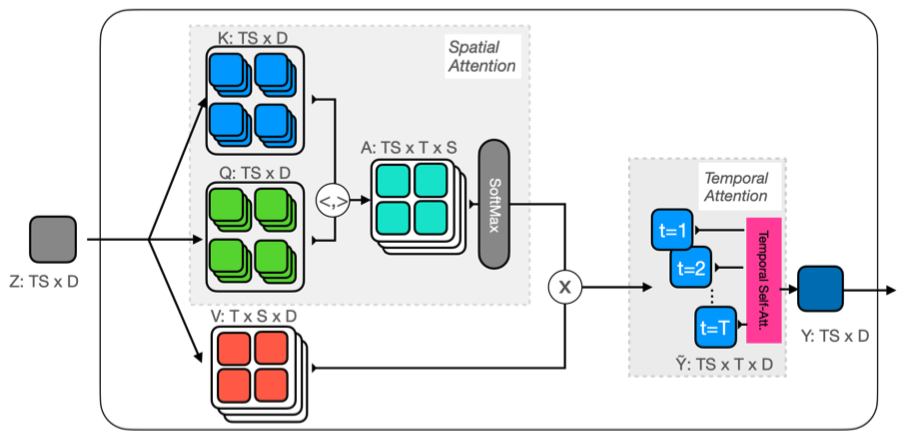
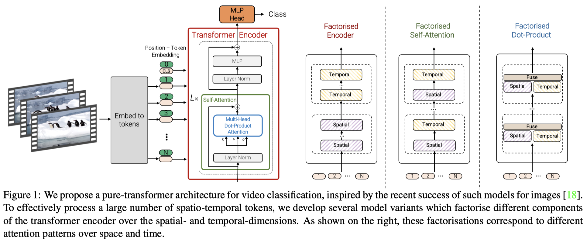

# Papers on Transformer

### [VISOLO: Grid-Based Space-Time Aggregation for Efficient Online Video Instance Segmentation](https://arxiv.org/pdf/2112.04177v1.pdf)

#### Overall Impressions

The task of video instance segmentation (VIS) is to generate spatio-temporal pixel masks for objects. VISOLO aims to address online VIS, where predictions need to be made on-the-fly as new frames are received. 

The core of this method is the similarity between features in the current frame and those in the previous frames. This similarity is used to weight the previous features and aggregate them into the current frame. The intuition is also straightforward: history features with high similarities might be related to the current instance and therefore should contribute more information. 

The concept of using similarity to weight features is similar to transformer, but it's only done once and there is no differentiation between query, key and value. I'd expect transformer to perform better given that it's configured properly. 

#### Key Ideas
- **Memory matching module**: compute the similarity between feature vectors of the current frame and those of the history frames.
- **Temporal aggregation module**: The feature maps of the previous frames are aggregated through a weighted summation, where the weights are computed as softmax of the similarity. 
- **Score reweighting module**: This part is not clearly explained in the paper. A weight map with the same spatial dimension as the feature map is calculated by taking the *maximum* similarity of each pixel with *all* pixels in a previous frame. This weight map is used to scale the output score. The intuition behind this module might be: pixels with high similarity with pixels in the previous frame may be more trustworthy.
- **Instance tracking**: the similarity can be used to track object instances, i.e., the current instanced are connected to the previous instances with the maximum similarity. 

### [Keeping your eye on the ball: Trajectory attention in video transformers](https://arxiv.org/pdf/2106.05392.pdf) \[MotionFormer][NIPS 2021\]

#### Overall Impression

Transformer modules pool information globally from the entire spatial-temporal domain regardless of the spatial locality (considered as the most important inductive bias). The core idea of this paper is to modify the self-attention mechanism of the standard transformer to lend an inductive bias to the model. Given the theoratically high complexity in both space and time, this paper uses a bottleneck self-attention mechanism. 

#### Key Ideas

- Architecture:
  - Use [Cuboid embedding](https://arxiv.org/pdf/2103.15691.pdf) to encode the input video $I \in R^{T' \times 3 \times H \times W}$ into a sequence of $ST$ tokens $\bold{x}_{st} \in R^D$ ($S$ tokens per frame for $T$ key frames).
  - A learnable positional encoding is added for spatial and temporal dimensions separately $\bold{z}_{st} = \bold{x}_{st} + \bold{e}_s^s + \bold{e}_t^t$
  - Video self-attention is applied on $\bold{z}_{st}$ to produce $\bold{y}_{st}$ for downsteam tasks.
- Considerations on computational efficiency:
  - The standard self-attention on $ST$ tokens (joint space-time attention) would have quadratic complexity in both space and time $O(S^2T^2)$. 
  - An alternative is to restrict attention to either space or time, which reduces the the complexity to $O(ST^2)$ or $O(S^2T)$. However, this mechanism only allows the model to analyze time and space independently and interleaving or stacking of the two attentions is needed. 
  - This paper propose *trajectory attetion*.It first produce trajectory tokens $\tilde{\bold{y}}_{stt'}$ by pooling the values $\bold{v}_{s't'}$ at time $t'$ using the attention applied spatially (index $s$) and independently for each frame $t'$. It then produces tokens $\bold{y}_{st}$ for the space-time domain by applying 1D attention on $\tilde{\bold{y}}_{stt'}$. The first step has complexity $O(S^2T^2)$, while the second steps has complexity $O(ST^2)$. 
  - To reduce the computation complexty, instead of calculating the self-attention directly on the $N=ST$ tokens, it employs prototpes with $R \ll N$ tokens. The cross-attention is applied between the input tokens and the prototype tokens, and then to the output tokens. It reduces the complexity from $R^{N \times N}$ to $R^{R\times N}$. 
  - To select the prototypes, a greedy strategy is employed: prototypes are incrementally built from the set of queries and keys such that a new prototype is maximally orthogonal to the prototypes already selected, starting with a query or key at random. This approximation mechanism is called **Orthoformer attention**.

#### Notes

- While the implementation of the approximation mechanism is straight forward on standard self-attention modules, it is unclear to me how it is applied on the proposed trajectory attention, since the keys and queries share subscripts. Need to read the source code to understand this detail.

  

 

### [Multiscale vision transformers](https://arxiv.org/pdf/2104.11227.pdf) \[MViT\]

#### Overall Impression

Convolutional Neural Networks typically gradually reduce the spatial resolution (and increase the number of channels) as the layer goes deeper. Vision transformers, however, do not have this "multi-scale" behavior and the number of tokens are usually kept the same throughout the network. To mimick the multi-scale behavior, MViT introduces pooling into the attention module, a.k.a. **Multi Head Pooling Attention (MHPA)**. The keys, values and queries are pooled to reduce the spatial (and temporal for video) resolutions before the attention calculation and application to produce features with a reduced size. In MViT, MHPA is applied to have reduce spatial/temporal resolution (and increase channel) as the layers go deeper. 

One advantage of MViT is the computational efficiency comparing to standard transformers (e.g., ViT and ViViT) due to the reduced resolution and flexibility in choosing the lenght of keys and values. The mult-scale design also seems to have a good intuition behind it, that is, the early layers aggregates information into tokens with coarser spatial/temporal resolution

#### Key Ideas

- The core of MViT is the **Multi Head Pooling Attention (MHPA)**, which pools the keys and values to dimension $\tilde{T}\tilde{H}\tilde{W}$ and pools the query to $\hat{T}\hat{H}\hat{W}$ and produces outputs with dimension $\hat{T}\hat{H}\hat{W}$. 
- **Initial scale:** at the input layer, the patches are projected to a smaller channels dimension (8x smallers than the standard ViT) but long sequence (4x4=16x denser than the standard ViT). 
- **Channel expansion**: When the space-time resolution is reduced by 4x, the channel dimension is increased by 2x.
- **Query pooling**: The query pooling controls the space-time resolution. Only the first MHPA in each stage has a query pooling stride >1, while all other operators have query pooling stride=1.
- **Key-value pooling**: While Q pooling is applied in the first layer of each stage, K, V pooling are applied in all other layers. This is mainly due to computation consideration. 

  

  
 

### [Vivit: A video vision transformer](https://arxiv.org/pdf/2103.15691.pdf)

#### Overall Impression

Given the promising results of Vision Transformer (ViT), it is natural to explore the possibility of applying transformer on videos. ViViT is one of the attempts in this direction. Overall, this paper does not give us much suprise. The few variants of transformer models for video discussed in this paper demonstrates the natural steps and thinking process while extending ViT to video. 

#### Key Ideas

1. Video embedding:
   1. Uniform frame sampling: sample frames from the video to produce the temporal domain tokens. 
   2. Tubelet embedding: extract 3D tubes from the spatial-temporal feature map encoded by 3D ConvNet.

2. Model:
   1. Spatial-temporal attention: flatten tokens in the spatial and temporal domain, then apply ViT.
   2. Factorized encoder: apply self-attention in each frame to produce per frame encoding, then apply self-attention across time.
   3. Factorized self-attention: constrain the self-attention to either the spatial domain or the temporal domain, and interleave these two types of attentions.
   4. Factorized dot-product attention: similar to the factorized self-attention, but use the two types of attentions concurrently and combine the results by concatenation.

#### Technical Details

1. Whe use tubelet encoding, the 3D convolution kernels are initialized with zeros along the temporal position, except at the centre.
2. When use factorized self-attention, the spatial modules are initialized from the pretrained module, while the temporal modules are initialized with all zeros. [Why this design choice?]

#### Conclusions

1. The spatio-temporal model performs better than other models on K400, but at the same time, it is also more computationally expensive and tend to overfit on smaller datasets.
2. Central frame initialization for tubelet encoding has advantages over other initializations.
3. The use of regularisers can provide substantial improvements.
4. Higher number of token can increase the accuracy, but at the cost of higher computation. The number of tokens can be increased by 1) reducing tubelet size and 2) increasing image size.
5. Increasing the number of frames can improve accuracy from processing a single clip. When the number of frames covers the whole video, the accuracy fro processing the single clip is higher than averaging the results over multiple shorter clips (the common practice in video understanding).

  
