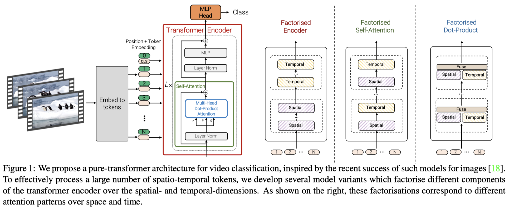

# [Vivit: A video vision transformer](https://arxiv.org/pdf/2103.15691.pdf)
December 2021

### Overall Impression
Given the promising results of Vision Transformer (ViT), it is natural to explore the possibility of applying transformer on videos. ViViT is one of the attempts in this direction. Overall, this paper does not give us much suprise. The few variants of transformer models for video discussed in this paper demonstrates the natural steps and thinking process while extending ViT to video. 

### Key Ideas
1. Video embedding:
    1. Uniform frame sampling: sample frames from the video to produce the temporal domain tokens. 
    2. Tubelet embedding: extract 3D tubes from the spatial-temporal feature map encoded by 3D ConvNet.
    
2. Model:
    1. Spatial-temporal attention: flatten tokens in the spatial and temporal domain, then apply ViT.
    2. Factorized encoder: apply self-attention in each frame to produce per frame encoding, then apply self-attention across time.
    3. Factorized self-attention: constrain the self-attention to either the spatial domain or the temporal domain, and interleave these two types of attentions.
    4. Factorized dot-product attention: similar to the factorized self-attention, but use the two types of attentions concurrently and combine the results by concatenation.

### Technical Details
1. Whe use tubelet encoding, the 3D convolution kernels are initialized with zeros along the temporal position, except at the centre.
2. When use factorized self-attention, the spatial modules are initialized from the pretrained module, while the temporal modules are initialized with all zeros. [Why this design choice?]

### Conclusions
1. The spatio-temporal model performs better than other models on K400, but at the same time, it is also more computationally expensive and tend to overfit on smaller datasets.
2. Central frame initialization for tubelet encoding has advantages over other initializations.
3. The use of regularisers can provide substantial improvements.
4. Higher number of token can increase the accuracy, but at the cost of higher computation. The number of tokens can be increased by 1) reducing tubelet size and 2) increasing image size.
5. Increasing the number of frames can improve accuracy from processing a single clip. When the number of frames covers the whole video, the accuracy fro processing the single clip is higher than averaging the results over multiple shorter clips (the common practice in video understanding).

